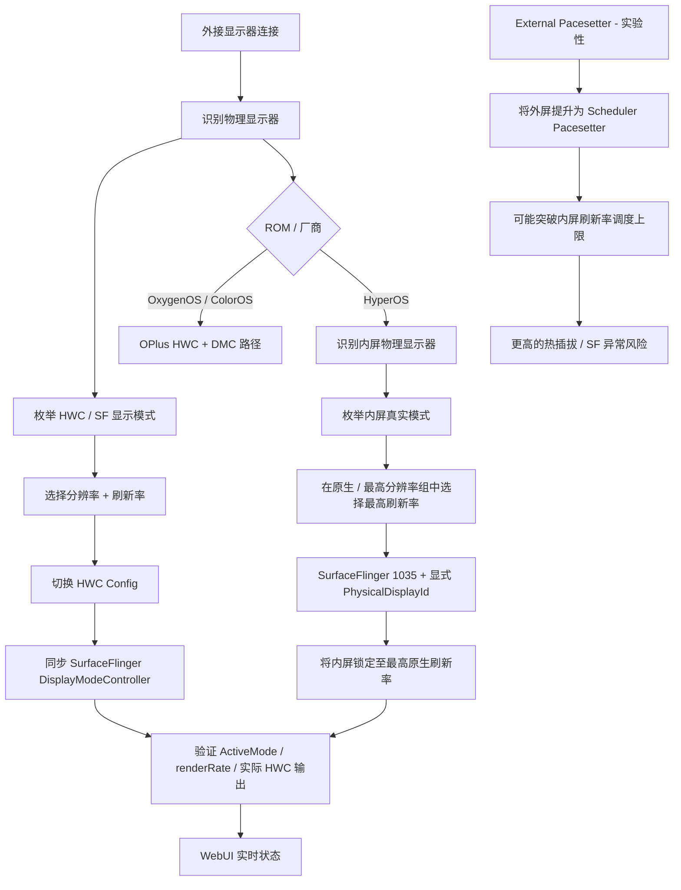
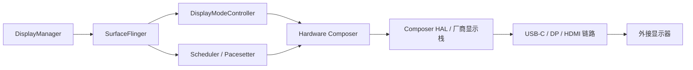
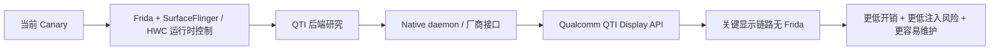
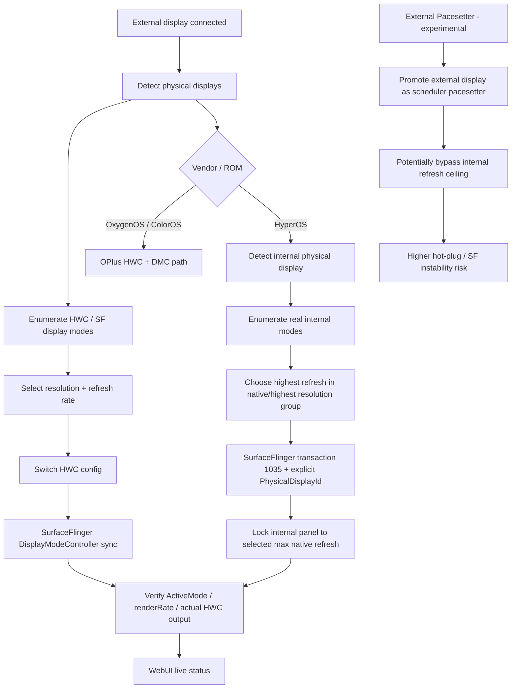
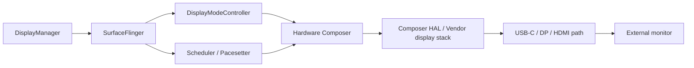
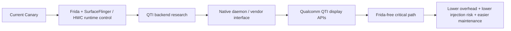

<a id="top"></a>

<p align="center">
  <strong><a href="#zh-cn">简体中文</a> · <a href="#english">English</a></strong>
</p>

<a id="zh-cn"></a>

# OPlusAutoHR

> 面向 **OxygenOS / ColorOS / HyperOS** 的 Android 外接显示器高刷新率控制模块。
>
> 需要 Root · Source Available（源码公开）· 当前分支：**V2 Canary**

<p align="center">
  <strong>HWC 模式控制 · SurfaceFlinger 同步 · HyperOS 高刷修复 · Scheduler 调度诊断</strong>
</p>

<p align="center">
  <a href="https://github.com/Kimuinaii/OPlusAutoHR/releases">Releases / 下载</a> ·
  <a href="https://github.com/Kimuinaii/OPlusAutoHR/issues">Issues / 问题反馈</a> ·
  <a href="USER_AGREEMENT.md">用户协议</a> ·
  <a href="SOURCE_AVAILABLE_NOTICE.md">源码公开说明</a>
</p>

---

## ⚠️ 重要风险警告

> [!WARNING]
> 当前 Canary 版本使用基于 **Frida 的运行时注入**进入 `surfaceflinger`。这是实验性的系统底层技术，可能导致运行环境异常、SurfaceFlinger 不稳定、热插拔异常，或被部分反作弊系统识别为异常环境。

当前测试 / 反馈中已知：

- **VALORANT Mobile / 无畏契约手游**：在当前测试环境中，进入约 **3 天观察期**的概率非常高，现有测试接近可复现。
- **Delta Force / 三角洲行动**：存在概率性临时 **1 天限制 / 封禁**反馈。

OPlusAutoHR **不会修改游戏数据**，也不提供作弊、反作弊绕过、Frida 隐藏、Root 隐藏或封禁规避功能。但 Root / Frida / 进程注入本身可能被反作弊系统视为异常环境。

**如果你在意竞技游戏账号安全，请不要在重要账号 / 设备上使用当前基于 Frida 的版本。**

此外，External Pacesetter 属于额外的 **高风险实验性功能**。它可能导致内屏低刷新率、外屏热插拔严重卡顿 / 近似冻结，或 SurfaceFlinger 异常。该功能默认关闭。

---

## 界面截图

<p align="center">
  
  &nbsp;&nbsp;
  
</p>

<p align="center">
  
  &nbsp;
  
  &nbsp;
  
</p>

---

## OPlusAutoHR 是什么？

部分 Android 设备和扩展坞在硬件上可以输出 120 / 144 / 165 / 180 / 240 Hz，但 Android 显示链路中的某些层仍可能以更低的刷新率调度或记录当前模式。

典型的不同步情况可能是：

```text
显示器 / HWC 实际输出：     180 Hz
SurfaceFlinger ActiveMode：  60 Hz
Scheduler / 渲染调度：       60 Hz
```

因此，**“显示器 OSD 显示 180 Hz”并不一定代表 Android 真正以 180 Hz 渲染。**

OPlusAutoHR 会协调显示链路的多个层级，在厂商实现允许的情况下，让 HWC 物理模式、SurfaceFlinger DisplayMode 与 Scheduler 调度状态尽可能保持一致。

---

## 实现路径



### Android 显示链路



---

## 功能

- 自动识别外接物理显示器
- 自动枚举 HWC / SurfaceFlinger 显示模式
- 分辨率切换
- 刷新率切换
- 自动最高刷新率模式
- HWC 切换后的延迟成功 reconciliation / 二次确认
- SurfaceFlinger `ActiveMode` / `renderRate` 同步
- HyperOS 内屏最高刷新率修复
- HyperOS 显式指定内屏 `PhysicalDisplayId`
- HWC / SurfaceFlinger 实时同步状态
- Scheduler / Pacesetter 调度诊断
- 手动切换显示模式后的 10 秒确认 / 自动回退
- External Pacesetter 高风险实验模式
- WebUI 控制界面
- 首次启动带版本控制的用户协议与免责声明

HyperOS 的内屏分辨率、刷新率、`modeId`、`PhysicalDisplayId` 均**不写死**，模块会在运行时读取设备真实暴露的模式。

---

## HyperOS 路径

当外接物理显示器连接，且 HyperOS 修复已启用时，OPlusAutoHR 会：

1. 识别内屏物理显示器；
2. 读取其真实 SurfaceFlinger DisplayMode；
3. 选择最高 / 原生分辨率模式组；
4. 在该分辨率组内选择最高真实刷新率；
5. 动态获取对应 `modeId`；
6. 通过 SurfaceFlinger transaction `1035`，携带该 `modeId` 与显式内屏 `PhysicalDisplayId`；
7. 验证最终实际生效的 active mode。

Xiaomi / Redmi / POCO / HyperOS 设备首次安装时默认将该功能设为 **开启**；其他设备默认关闭。

当前 Canary 实现中，本次开机已经执行的锁定可能在关闭自动触发后继续保持，直到设备重启或 SurfaceFlinger 生命周期重置。这是当前版本的预期行为。

---

## OPlus / OxygenOS / ColorOS 路径

OPlus 路径通过运行时解析显示接口，实现：

- 枚举 HWC display config；
- 切换真实硬件显示模式；
- 同步 SurfaceFlinger DisplayModeController 状态；
- 对厂商 `getActiveConfig` 延迟返回进行 reconciliation；
- SurfaceFlinger 生命周期变化后的引擎恢复；
- 开启自动最高刷新率后，在 hot-plug 时自动选择外屏最高模式。

不同 ROM / Android 版本的厂商实现可能不同，因此兼容性以真实设备验证为准，而不是只根据品牌推断。

---

## 已验证状态

| 平台 | Android | 当前状态 | 说明 |
|---|---:|---|---|
| OnePlus / OxygenOS | 16 | ✅ 已验证 | 真机验证 HWC 切换 + DMC/SF 同步 |
| Xiaomi / HyperOS | 16 | ✅ 已验证 | 真机验证 HWC/SF 路径 + 自动内屏最高刷修复 |
| OPPO / ColorOS | 16 | 🟡 实验性 / 依设备而定 | 使用 OPlus 系路径，仍需更广泛测试 |
| realme UI | 15 / 16 | 🟡 实验性 / 依设备而定 | 厂商实现可能存在差异 |
| 其他 Android ROM | — | ⚪ 研究 / 暂不支持 | 取决于 SurfaceFlinger / Composer HAL 实现 |

> [!NOTE]
> 软件路径已验证，并不代表所有扩展坞、线材、显示器、EDID、ROM 版本都会表现一致。

---

## 安装

### 要求

- Root 权限
- Magisk / KernelSU / APatch 或兼容的模块环境
- 设备本身支持外接视频输出
- 兼容的显示器 / 扩展坞 / 线材链路

### 安装步骤

1. 打开仓库的 **Releases** 页面；
2. 下载已经打包好的 OPlusAutoHR 模块 ZIP；
3. 使用 Root 模块管理器安装 / 刷入；
4. 重启设备；
5. 连接外接显示器；
6. 打开 OPlusAutoHR WebUI；
7. 首次启动阅读并同意用户协议；
8. 手动选择分辨率 / 刷新率，或开启“自动最高刷新率”。

> [!IMPORTANT]
> **不要把 GitHub 的 “Code → Download ZIP” 源码压缩包当作 Root 模块安装。** 请从 **Releases** 下载已经打包的模块。

---

## External Pacesetter

External Pacesetter 可以强制外接显示器成为 SurfaceFlinger 的调度基准，并可能让外屏突破内屏正常的调度刷新率上限。

该功能当前属于 **高风险实验功能**，默认关闭。

已知 / 已观察风险包括：

- 内屏下降到低刷新率；
- 拔出外接显示器后严重卡顿；
- 受影响的厂商路径上可能出现近似冻结 / 约 1 Hz UI；
- SurfaceFlinger 调度异常；
- 实验过程中 SurfaceFlinger 重启 / SystemUI 不稳定。

仅建议了解恢复方法的测试用户开启。

---

## 项目性质

OPlusAutoHR 当前属于 **Source Available / 源码公开**，而不是 OSI 定义下的 Open Source，因为目前限制未经授权的商业 / 盈利用途。

源码主要提供用于：

- 个人学习；
- Android 显示系统研究；
- SurfaceFlinger / HWC 研究；
- 非商业修改与测试；
- 技术交流与兼容性研究。

详细条款见：

- [`LICENSE`](LICENSE)
- [`USER_AGREEMENT.md`](USER_AGREEMENT.md)
- [`SOURCE_AVAILABLE_NOTICE.md`](SOURCE_AVAILABLE_NOTICE.md)
- [`THIRD_PARTY_NOTICES.md`](THIRD_PARTY_NOTICES.md)

---

## Roadmap / 后续计划

- [x] 自动物理显示器识别
- [x] HWC DisplayMode 枚举
- [x] 分辨率 / 刷新率切换
- [x] SurfaceFlinger DMC 同步
- [x] HyperOS 内屏最高刷新率修复
- [x] WebUI 与实时调度诊断
- [x] External Pacesetter 实验功能
- [ ] 扩大 OxygenOS / ColorOS / realme UI 真机验证范围
- [ ] 建立更完善的兼容性数据库与自动问题诊断
- [ ] 减少对私有符号的依赖
- [ ] 研究 Qualcomm QTI Display / SurfaceFlinger 厂商接口
- [ ] Native QTI 后端控制路径
- [ ] 逐步从关键显示链路移除 Frida 注入
- [ ] 在支持的设备上实现完全无 Frida 的稳定后端

### 目标架构



长期目标是在可用的平台优先使用 Qualcomm QTI Display / SurfaceFlinger 厂商接口，**真正替代 Frida 注入，而不是隐藏 Frida**。非 QTI 平台的兼容方案会独立继续研究。

---

## 问题反馈

反馈问题时，请尽量提供：

- 设备型号与代号；
- SoC；
- Android 版本；
- ROM 与完整 ROM 版本；
- Root 方案；
- 扩展坞 / 转接器型号；
- HDMI / DP / USB-C / USB4 连接路径；
- 显示器型号与期望的分辨率 / 刷新率；
- OPlusAutoHR 版本；
- WebUI 截图；
- `oahctl status`；
- 相关 `engine.log`；
- 清晰的复现步骤。

建议优先使用仓库中的 **Bug Report** Issue 模板。

---

## 源码与运行时二进制

本仓库包含项目源码和脚本。体积较大的第三方运行时二进制，在其准确来源与再分发条款确认前不会提交进源码仓库。详见 [`THIRD_PARTY_NOTICES.md`](THIRD_PARTY_NOTICES.md)。

---

## Credits / 致谢

### Maintainers / Authors

- Kimu
- 酷安 @苦力小怕
- 酷安 @念来过倒别叫你

### Development assistance

- ChatGPT by OpenAI

---

**OPlusAutoHR V2 Canary** — 实验性的 Android 外接显示研究项目。

<p align="right"><a href="#top">↑ Back to top / 返回顶部</a></p>

---

<a id="english"></a>

<p align="center">
  <strong><a href="#zh-cn">简体中文</a> · <a href="#english">English</a></strong>
</p>

# OPlusAutoHR

> Android external-display high-refresh-rate controller for **OxygenOS / ColorOS / HyperOS**.
>
> Root required · Source Available · Current branch: **V2 Canary**

<p align="center">
  <strong>HWC mode control · SurfaceFlinger synchronization · HyperOS high-refresh repair · Scheduler diagnostics</strong>
</p>

<p align="center">
  <a href="https://github.com/Kimuinaii/OPlusAutoHR/releases">Releases</a> ·
  <a href="https://github.com/Kimuinaii/OPlusAutoHR/issues">Issues</a> ·
  <a href="USER_AGREEMENT.md">User Agreement</a> ·
  <a href="SOURCE_AVAILABLE_NOTICE.md">Source Available Notice</a>
</p>

---

## ⚠️ Important risk warning

> [!WARNING]
> Current Canary builds use **Frida-based runtime injection into `surfaceflinger`**. This is an experimental system-level technique and may cause environment anomalies, SurfaceFlinger instability, hot-plug problems, or anti-cheat detection.

Known observations from current testing / reports:

- **VALORANT Mobile / 无畏契约手游**: very high likelihood of entering an approximately **3-day observation period** in the currently tested environment (reported as close to reproducible).
- **Delta Force / 三角洲行动**: reported probability of a temporary **1-day restriction / ban**.

OPlusAutoHR does **not** modify game data and does not provide cheating, anti-cheat bypass, Frida hiding, Root hiding, or ban-evasion functionality. However, Root / Frida / process injection may itself be considered an abnormal environment by anti-cheat systems.

**Do not use current Frida-based builds on devices or accounts where anti-cheat safety is important.**

External Pacesetter is an additional **high-risk experimental** feature. It may cause internal-panel low refresh, hot-plug stalls / near-freezes, or SurfaceFlinger abnormalities. It is disabled by default.

---

## Screenshots

<p align="center">
  
  &nbsp;&nbsp;
  
</p>

<p align="center">
  
  &nbsp;
  
  &nbsp;
  
</p>

---

## What is OPlusAutoHR?

Some Android devices and docks can physically output 120 / 144 / 165 / 180 / 240 Hz, while the Android display stack still schedules or reports part of the pipeline at a lower refresh rate.

A typical mismatch can look like this:

```text
Monitor / HWC output:        180 Hz
SurfaceFlinger ActiveMode:    60 Hz
Scheduler / render cadence:   60 Hz
```

So **“the monitor says 180 Hz” does not always mean Android is really rendering at 180 Hz**.

OPlusAutoHR coordinates multiple layers of the display pipeline so that the physical HWC mode, SurfaceFlinger display mode, and scheduler state can stay consistent where the vendor implementation allows it.

---

## How it works



### Display pipeline



---

## Features

- Automatic external physical-display detection
- Automatic HWC / SurfaceFlinger mode enumeration
- Resolution switching
- Refresh-rate switching
- Automatic maximum refresh-rate mode
- HWC mode switching with late-success reconciliation
- SurfaceFlinger `ActiveMode` / `renderRate` synchronization
- HyperOS internal-display max-refresh repair
- Explicit internal `PhysicalDisplayId` targeting on HyperOS
- Live HWC / SurfaceFlinger synchronization status
- Scheduler / Pacesetter diagnostics
- 10-second confirmation / rollback for manual display-mode changes
- Experimental External Pacesetter mode with explicit high-risk warning
- WebUI control interface
- First-run versioned User Agreement & Disclaimer

No HyperOS internal resolution, refresh rate, `modeId`, or `PhysicalDisplayId` is hard-coded. The module discovers the actual modes exposed by the device at runtime.

---

## HyperOS path

When an external physical display is connected and the HyperOS fix is enabled, OPlusAutoHR:

1. identifies the internal physical display;
2. reads its real SurfaceFlinger display modes;
3. selects the highest / native-resolution mode group;
4. chooses the highest real refresh rate inside that group;
5. obtains the real `modeId` dynamically;
6. sends SurfaceFlinger transaction `1035` with that `modeId` and the explicit internal `PhysicalDisplayId`;
7. verifies the resulting active mode.

Xiaomi / Redmi / POCO / HyperOS devices default this feature to **ON** on first installation. Other devices default it to OFF.

A lock already applied during the current boot may remain until reboot / SurfaceFlinger lifecycle reset even if automatic triggering is later disabled. This is intentional in the current Canary implementation.

---

## OPlus / OxygenOS / ColorOS path

The OPlus path uses runtime-resolved display interfaces to:

- enumerate HWC display configs;
- switch the real hardware display mode;
- synchronize SurfaceFlinger DisplayModeController state;
- reconcile delayed vendor `getActiveConfig` results;
- recover the engine across SurfaceFlinger lifecycle changes;
- automatically select the highest external-display mode on hot-plug when enabled.

Vendor implementations differ by ROM / Android release, so compatibility is validated per device rather than assumed from the brand name alone.

---

## Verified status

| Platform | Android | Current status | Notes |
|---|---:|---|---|
| OnePlus / OxygenOS | 16 | ✅ Verified | HWC switching + DMC/SF synchronization verified on real hardware |
| Xiaomi / HyperOS | 16 | ✅ Verified | HWC/SF path + automatic internal max-refresh repair verified on real hardware |
| OPPO / ColorOS | 16 | 🟡 Experimental / device-dependent | Uses the OPlus-family path; wider testing is needed |
| realme UI | 15 / 16 | 🟡 Experimental / device-dependent | Vendor implementation may differ |
| Other Android ROMs | — | ⚪ Research / unsupported | Depends on SurfaceFlinger / Composer HAL implementation |

> [!NOTE]
> A verified software path does not guarantee every dock, cable, monitor, EDID combination, or ROM build will behave identically.

---

## Installation

### Requirements

- Root access
- Magisk / KernelSU / APatch or a compatible module environment
- Device with external video output support
- Compatible external display / dock / cable path

### Install

1. Open the repository **Releases** page.
2. Download the packaged OPlusAutoHR module ZIP.
3. Install / flash it using your Root module manager.
4. Reboot the device.
5. Connect the external display.
6. Open the OPlusAutoHR WebUI.
7. Read and accept the User Agreement on first launch.
8. Select a resolution / refresh rate, or enable automatic maximum refresh rate.

> [!IMPORTANT]
> **Do not install GitHub's “Code → Download ZIP” source archive as a Root module.** Download the packaged module from **Releases**.

---

## External Pacesetter

External Pacesetter can force the external display to become SurfaceFlinger's scheduling pacesetter and may allow the external display to operate beyond the internal panel's normal scheduling ceiling.

It is currently **high-risk experimental** and disabled by default.

Known / observed risk areas include:

- internal display falling to a low refresh rate;
- severe stutter after external-display hot-unplug;
- near-freeze / approximately 1 Hz UI behavior on affected vendor paths;
- SurfaceFlinger scheduling abnormalities;
- SurfaceFlinger restart / system UI instability during experiments.

Use it only if you understand how to recover the device.

---

## Project nature

OPlusAutoHR is currently **Source Available**, not OSI Open Source, because unauthorized commercial / profit-making use is currently restricted.

The source is provided primarily for:

- personal learning;
- Android display-system research;
- SurfaceFlinger / HWC research;
- non-commercial modification and testing;
- technical discussion and compatibility research.

See:

- [`LICENSE`](LICENSE)
- [`USER_AGREEMENT.md`](USER_AGREEMENT.md)
- [`SOURCE_AVAILABLE_NOTICE.md`](SOURCE_AVAILABLE_NOTICE.md)
- [`THIRD_PARTY_NOTICES.md`](THIRD_PARTY_NOTICES.md)

---

## Roadmap

- [x] Automatic physical-display detection
- [x] HWC display-mode enumeration
- [x] Resolution / refresh-rate switching
- [x] SurfaceFlinger DMC synchronization
- [x] HyperOS internal max-refresh repair
- [x] WebUI and live scheduler diagnostics
- [x] Experimental External Pacesetter
- [ ] Wider OxygenOS / ColorOS / realme UI device verification
- [ ] Better compatibility database and automated issue diagnostics
- [ ] Reduce private-symbol dependencies
- [ ] Research Qualcomm QTI display / SurfaceFlinger vendor interfaces
- [ ] Native QTI-backed control path
- [ ] Gradually remove Frida injection from the critical display path
- [ ] Frida-free stable backend where supported

### Intended future architecture



The long-term goal is to use Qualcomm QTI display / SurfaceFlinger vendor interfaces where available and **replace Frida injection rather than hide it**. Non-QTI fallback research may continue separately.

---

## Issue reporting

When reporting a problem, please include as much of the following as possible:

- device model and codename;
- SoC;
- Android version;
- ROM and full ROM version;
- Root solution;
- dock / adapter model;
- HDMI / DP / USB-C / USB4 connection path;
- monitor model and expected resolution / refresh rate;
- OPlusAutoHR version;
- WebUI screenshot;
- `oahctl status`;
- relevant `engine.log` output;
- clear reproduction steps.

Use the repository's **Bug Report** issue template where possible.

---

## Source and runtime binaries

This repository contains project source and scripts. Large third-party runtime binaries are not committed to the source tree until their exact redistribution terms are verified. See [`THIRD_PARTY_NOTICES.md`](THIRD_PARTY_NOTICES.md).

---

## Credits

### Maintainers / authors

- Kimu
- 酷安 @苦力小怕
- 酷安 @念来过倒别叫你

### Development assistance

- ChatGPT by OpenAI

---

**OPlusAutoHR V2 Canary** — experimental Android external-display research project.

<p align="right"><a href="#top">↑ Back to top / 返回顶部</a></p>
