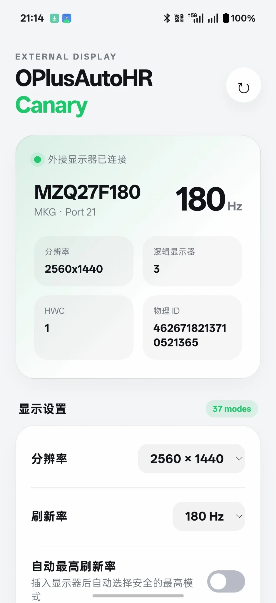
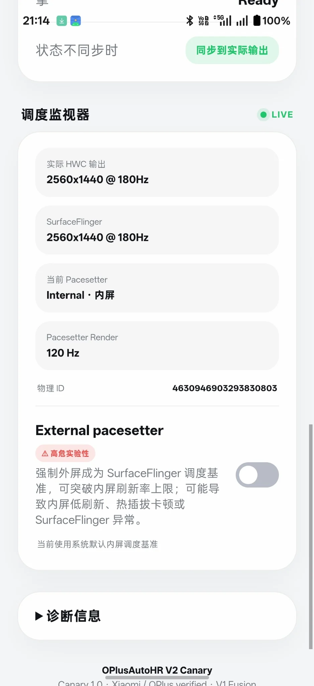
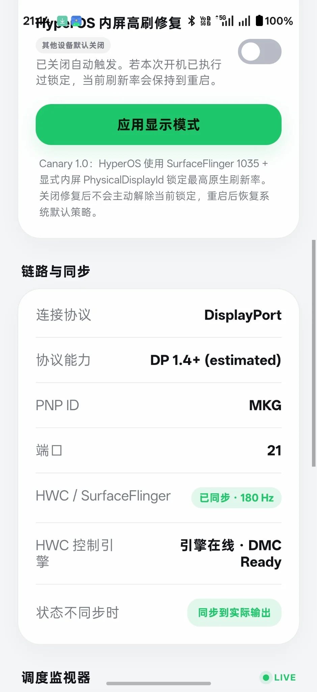
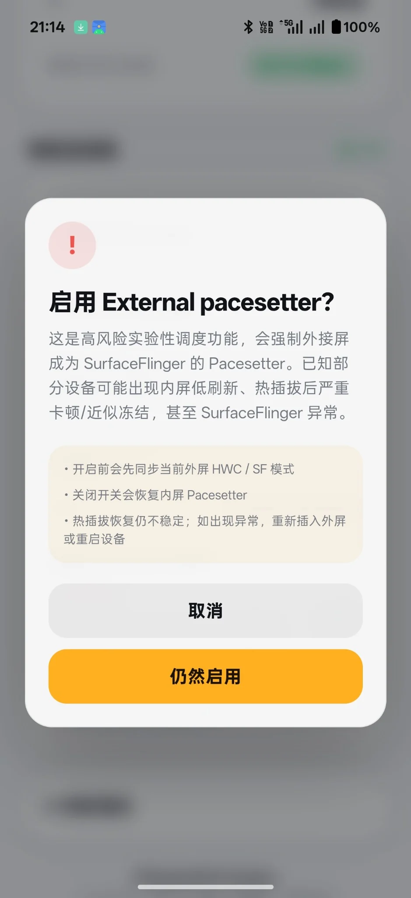
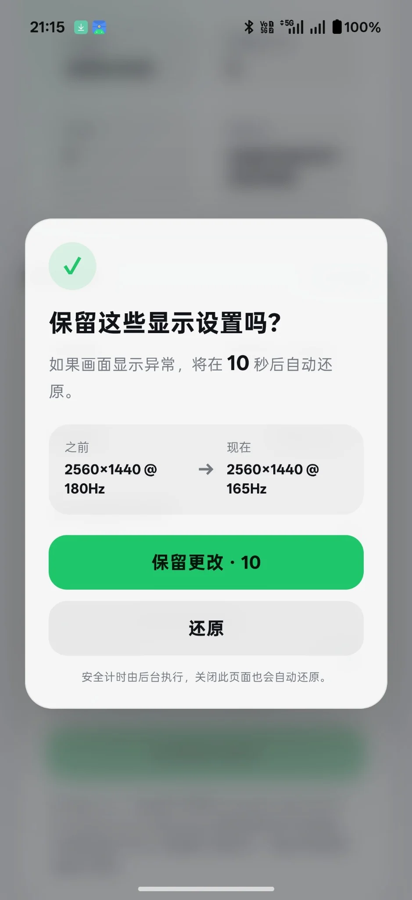
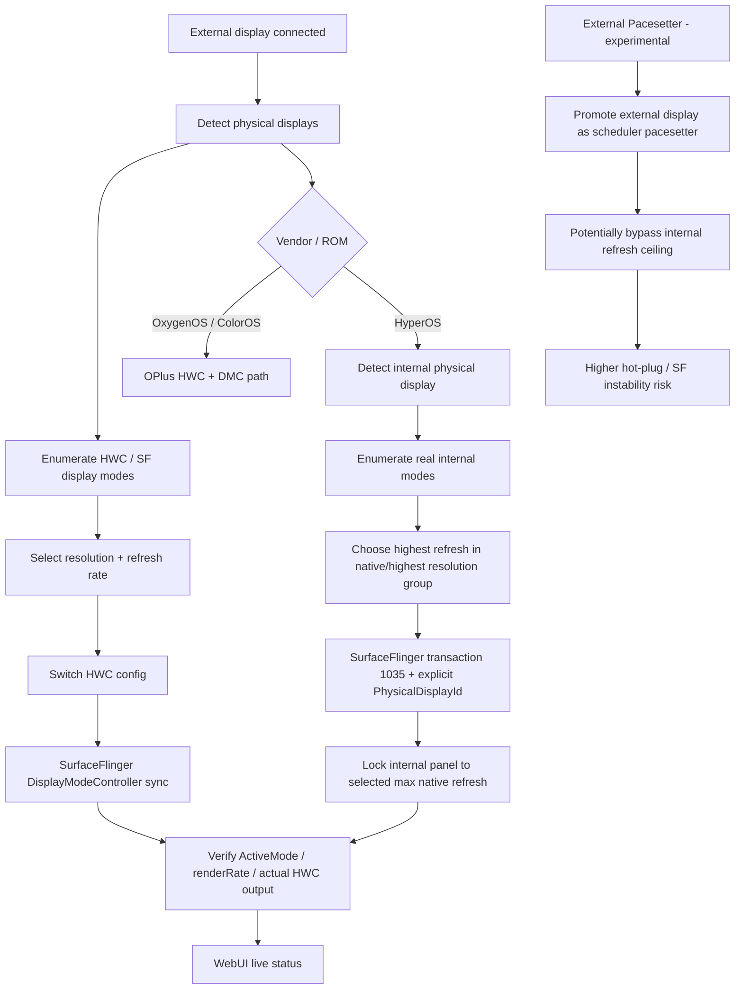
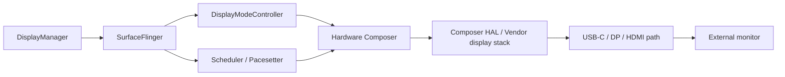
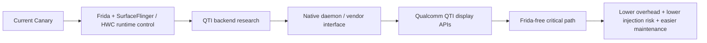

<p align="center">
  <strong><a href="README.md">简体中文</a> · English</strong>
</p>

# OPlusAutoHR

> Android external-display high-refresh-rate controller for **OxygenOS / ColorOS / HyperOS**.
>
> Root required · Source Available · Current branch: **V2 Canary**

<p align="center">
  <strong>HWC mode control · SurfaceFlinger synchronization · HyperOS high-refresh repair · Scheduler diagnostics</strong>
</p>

<p align="center">
  <a href="https://github.com/s1604006768-cpu/OPlusAutoHR/releases">Releases</a> ·
  <a href="https://github.com/s1604006768-cpu/OPlusAutoHR/issues">Issues</a> ·
  <a href="USER_AGREEMENT.md">User Agreement</a> ·
  <a href="SOURCE_AVAILABLE_NOTICE.md">Source Available Notice</a>
</p>

---

## ⚠️ Important risk warning

> [!WARNING]
> Current Canary builds use **Frida-based runtime injection into `surfaceflinger`**. This is an experimental system-level technique and may cause environment anomalies, SurfaceFlinger instability, hot-plug problems, or anti-cheat detection.

Known observations from current testing / reports:

- **VALORANT Mobile / 无畏契约手游**: very high likelihood of entering an approximately **3-day observation period** in the currently tested environment (reported as close to reproducible).
- **Delta Force / 三角洲行动**: reported probability of a temporary **1-day restriction / ban**.

OPlusAutoHR does **not** modify game data and does not provide cheating, anti-cheat bypass, Frida hiding, Root hiding, or ban-evasion functionality. However, Root / Frida / process injection may itself be considered an abnormal environment by anti-cheat systems.

**Do not use current Frida-based builds on devices or accounts where anti-cheat safety is important.**

External Pacesetter is an additional **high-risk experimental** feature. It may cause internal-panel low refresh, hot-plug stalls / near-freezes, or SurfaceFlinger abnormalities. It is disabled by default.

---

## Screenshots

<p align="center">
  
  &nbsp;&nbsp;
  
</p>

<p align="center">
  
  &nbsp;
  
  &nbsp;
  
</p>

---

## What is OPlusAutoHR?

Some Android devices and docks can physically output 120 / 144 / 165 / 180 / 240 Hz, while the Android display stack still schedules or reports part of the pipeline at a lower refresh rate.

A typical mismatch can look like this:

```text
Monitor / HWC output:        180 Hz
SurfaceFlinger ActiveMode:    60 Hz
Scheduler / render cadence:   60 Hz
```

So **“the monitor says 180 Hz” does not always mean Android is really rendering at 180 Hz**.

OPlusAutoHR coordinates multiple layers of the display pipeline so that the physical HWC mode, SurfaceFlinger display mode, and scheduler state can stay consistent where the vendor implementation allows it.

---

## How it works



### Display pipeline



---

## Features

- Automatic external physical-display detection
- Automatic HWC / SurfaceFlinger mode enumeration
- Resolution switching
- Refresh-rate switching
- Automatic maximum refresh-rate mode
- HWC mode switching with late-success reconciliation
- SurfaceFlinger `ActiveMode` / `renderRate` synchronization
- HyperOS internal-display max-refresh repair
- Explicit internal `PhysicalDisplayId` targeting on HyperOS
- Live HWC / SurfaceFlinger synchronization status
- Scheduler / Pacesetter diagnostics
- 10-second confirmation / rollback for manual display-mode changes
- Experimental External Pacesetter mode with explicit high-risk warning
- WebUI control interface
- First-run versioned User Agreement & Disclaimer

No HyperOS internal resolution, refresh rate, `modeId`, or `PhysicalDisplayId` is hard-coded. The module discovers the actual modes exposed by the device at runtime.

---

## HyperOS path

When an external physical display is connected and the HyperOS fix is enabled, OPlusAutoHR:

1. identifies the internal physical display;
2. reads its real SurfaceFlinger display modes;
3. selects the highest / native-resolution mode group;
4. chooses the highest real refresh rate inside that group;
5. obtains the real `modeId` dynamically;
6. sends SurfaceFlinger transaction `1035` with that `modeId` and the explicit internal `PhysicalDisplayId`;
7. verifies the resulting active mode.

Xiaomi / Redmi / POCO / HyperOS devices default this feature to **ON** on first installation. Other devices default it to OFF.

A lock already applied during the current boot may remain until reboot / SurfaceFlinger lifecycle reset even if automatic triggering is later disabled. This is intentional in the current Canary implementation.

---

## OPlus / OxygenOS / ColorOS path

The OPlus path uses runtime-resolved display interfaces to:

- enumerate HWC display configs;
- switch the real hardware display mode;
- synchronize SurfaceFlinger DisplayModeController state;
- reconcile delayed vendor `getActiveConfig` results;
- recover the engine across SurfaceFlinger lifecycle changes;
- automatically select the highest external-display mode on hot-plug when enabled.

Vendor implementations differ by ROM / Android release, so compatibility is validated per device rather than assumed from the brand name alone.

---

## Verified status

| Platform | Android | Current status | Notes |
|---|---:|---|---|
| OnePlus / OxygenOS | 16 | ✅ Verified | HWC switching + DMC/SF synchronization verified on real hardware |
| Xiaomi / HyperOS | 16 | ✅ Verified | HWC/SF path + automatic internal max-refresh repair verified on real hardware |
| OPPO / ColorOS | 16 | 🟡 Experimental / device-dependent | Uses the OPlus-family path; wider testing is needed |
| realme UI | 15 / 16 | 🟡 Experimental / device-dependent | Vendor implementation may differ |
| Other Android ROMs | — | ⚪ Research / unsupported | Depends on SurfaceFlinger / Composer HAL implementation |

> [!NOTE]
> A verified software path does not guarantee every dock, cable, monitor, EDID combination, or ROM build will behave identically.

---

## Installation

### Requirements

- Root access
- Magisk / KernelSU / APatch or a compatible module environment
- Device with external video output support
- Compatible external display / dock / cable path

### Install

1. Open the repository **Releases** page.
2. Download the packaged OPlusAutoHR module ZIP.
3. Install / flash it using your Root module manager.
4. Reboot the device.
5. Connect the external display.
6. Open the OPlusAutoHR WebUI.
7. Read and accept the User Agreement on first launch.
8. Select a resolution / refresh rate, or enable automatic maximum refresh rate.

> [!IMPORTANT]
> **Do not install GitHub's “Code → Download ZIP” source archive as a Root module.** Download the packaged module from **Releases**.

---

## External Pacesetter

External Pacesetter can force the external display to become SurfaceFlinger's scheduling pacesetter and may allow the external display to operate beyond the internal panel's normal scheduling ceiling.

It is currently **high-risk experimental** and disabled by default.

Known / observed risk areas include:

- internal display falling to a low refresh rate;
- severe stutter after external-display hot-unplug;
- near-freeze / approximately 1 Hz UI behavior on affected vendor paths;
- SurfaceFlinger scheduling abnormalities;
- SurfaceFlinger restart / system UI instability during experiments.

Use it only if you understand how to recover the device.

---

## Project nature

OPlusAutoHR is currently **Source Available**, not OSI Open Source, because unauthorized commercial / profit-making use is currently restricted.

The source is provided primarily for:

- personal learning;
- Android display-system research;
- SurfaceFlinger / HWC research;
- non-commercial modification and testing;
- technical discussion and compatibility research.

See:

- [`LICENSE`](LICENSE)
- [`USER_AGREEMENT.md`](USER_AGREEMENT.md)
- [`SOURCE_AVAILABLE_NOTICE.md`](SOURCE_AVAILABLE_NOTICE.md)
- [`THIRD_PARTY_NOTICES.md`](THIRD_PARTY_NOTICES.md)

---

## Roadmap

- [x] Automatic physical-display detection
- [x] HWC display-mode enumeration
- [x] Resolution / refresh-rate switching
- [x] SurfaceFlinger DMC synchronization
- [x] HyperOS internal max-refresh repair
- [x] WebUI and live scheduler diagnostics
- [x] Experimental External Pacesetter
- [ ] Wider OxygenOS / ColorOS / realme UI device verification
- [ ] Better compatibility database and automated issue diagnostics
- [ ] Reduce private-symbol dependencies
- [ ] Research Qualcomm QTI display / SurfaceFlinger vendor interfaces
- [ ] Native QTI-backed control path
- [ ] Gradually remove Frida injection from the critical display path
- [ ] Frida-free stable backend where supported

### Intended future architecture



The long-term goal is to use Qualcomm QTI display / SurfaceFlinger vendor interfaces where available and **replace Frida injection rather than hide it**. Non-QTI fallback research may continue separately.

---

## Issue reporting

When reporting a problem, please include as much of the following as possible:

- device model and codename;
- SoC;
- Android version;
- ROM and full ROM version;
- Root solution;
- dock / adapter model;
- HDMI / DP / USB-C / USB4 connection path;
- monitor model and expected resolution / refresh rate;
- OPlusAutoHR version;
- WebUI screenshot;
- `oahctl status`;
- relevant `engine.log` output;
- clear reproduction steps.

Use the repository's **Bug Report** issue template where possible.

---

## Source and runtime binaries

This repository contains project source and scripts. Large third-party runtime binaries are not committed to the source tree until their exact redistribution terms are verified. See [`THIRD_PARTY_NOTICES.md`](THIRD_PARTY_NOTICES.md).

---

## Credits

### Maintainers / authors

- Kimu
- 酷安 @苦力小怕
- 酷安 @念来过倒别叫你

### Development assistance

- ChatGPT by OpenAI

---

**OPlusAutoHR V2 Canary** — experimental Android external-display research project.
